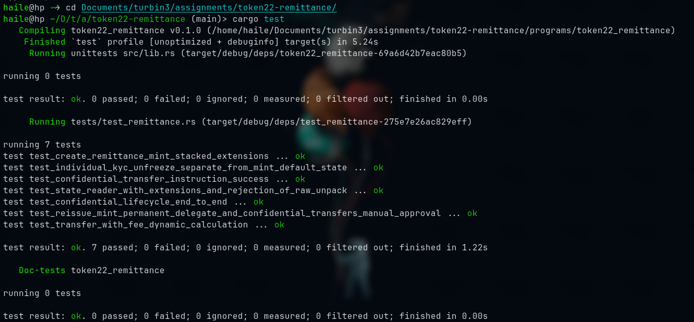

# Token-2022 Remittance Stablecoin

A remittance stablecoin program built on Solana with Anchor and SPL Token-2022. It implements protocol-level transfer fees, mandatory KYC account freezing, on-chain metadata pointers, mint decommissioning, regulatory seizure delegates, and zero-knowledge confidential transfers.

## Overview

Remittance stablecoins require balancing regulatory compliance, issuer revenue, and user financial privacy:
1. **Issuer Revenue:** Transfer fee extension deducts a configurable basis point fee on every transfer, calculated dynamically per epoch.
2. **KYC Enforcement:** Newly created accounts initialize as `Frozen` by default. Individual accounts are thawed by the freeze authority only after KYC verification.
3. **Self-Contained Metadata:** Metadata pointer targets the mint itself, eliminating reliance on off-chain registries.
4. **Decommissioning:** Mint close authority allows draining rent when the mint is retired.
5. **Regulatory Seizure & Confidentiality:** A re-issued mint introduces a `PermanentDelegate` (seizure authority) and `ConfidentialTransferMint` with manual approval policy (`approve_policy = manual`).

### The Cryptographic Gap

A fundamental architectural tension exists between `PermanentDelegate` and confidential balances:
* **Plaintext Balances:** The `PermanentDelegate` can unilaterally transfer or burn tokens held in plaintext.
* **Confidential Balances:** Once tokens are deposited into the confidential extension, balances exist as homomorphic ElGamal ciphertexts. The permanent delegate cannot decrypt balances or generate the required zero-knowledge range/equality proofs without the user's private key (or a designated auditor key).
* **Remediation:** Seizures require freezing the target account (preventing confidential withdrawals) or leveraging auditor ElGamal keys.

---

## Program Instructions

| Instruction | Description |
| :--- | :--- |
| `create_remittance_mint` | Initializes a mint stacking `TransferFeeConfig`, `MetadataPointer`, `DefaultAccountState` (Frozen), and `MintCloseAuthority`, sized via `ExtensionType::try_calculate_account_len`. |
| `reissue_remittance_mint` | Re-issues the mint with `PermanentDelegate` and `ConfidentialTransferMint` (manual approval policy) alongside transfer fees and metadata. |
| `transfer_with_fee` | Executes `transfer_checked_with_fee` computing the expected fee dynamically via `calculate_epoch_fee(current_epoch, amount)`. |
| `thaw_kyc_account` | Thaws an individual account via `freeze_authority` after KYC verification without modifying mint-level default state. |
| `configure_confidential_account` | Configures an account for confidential transfers with ElGamal encryption and zero-knowledge proof verification. Enforces owner-only signing. |
| `approve_confidential_account` | Approves a configured confidential account via the confidential transfer authority under `approve_policy = manual`. |
| `deposit_confidential_tokens` | Converts plaintext tokens into confidential pending balance via homomorphic ciphertext addition. |
| `apply_pending_balance` | Moves confidential tokens from pending balance to available balance. |
| `withdraw_confidential_tokens` | Converts confidential available balance back to plaintext tokens, with an optional flag to apply pending balance prior to withdrawal. |
| `confidential_transfer` | Executes an encrypted transfer between accounts using ZK proofs (`CiphertextCommitmentEquality`, `BatchedGroupedCiphertext3HandlesValidity`, and `BatchedRangeProofU128`). |

---

## State Safety

Account and mint states must never be unpacked via raw `unpack` or `try_from_slice`, as doing so discards extension TLV data. The program provides `StateReader` to enforce strict deserialization:

* `StateReader::unpack_mint(&data)`: Unpacks mint state via `StateWithExtensions<Mint>`.
* `StateReader::unpack_account(&data)`: Unpacks token account state via `StateWithExtensions<Account>`.
* `StateReader::verify_raw_unpack_rejected(&data)`: Verifies that raw byte inspection correctly rejects data containing extension headers.

---

## Tests

Integration tests are written in pure Rust using [LiteSVM](https://github.com/LiteSVM/litesvm) with `litesvm-token`. The test suite runs in-process with zero external validator or Node.js dependencies.

```bash
cargo test
```

### Test Results



### Test Coverage

1. **`test_create_remittance_mint_stacked_extensions`:**
   Verifies initialization order, correct account sizing, TLV offsets, and extension configurations for `TransferFeeConfig`, `MetadataPointer`, `DefaultAccountState` (Frozen), and `MintCloseAuthority`.
2. **`test_transfer_with_fee_dynamic_calculation`:**
   Verifies `transfer_checked_with_fee` using epoch-aware fee calculation (`calculate_epoch_fee`), fee deductions, and recipient balances.
3. **`test_state_reader_with_extensions_and_rejection_of_raw_unpack`:**
   Confirms `StateReader` safely extracts extensions and validates that legacy `Account::unpack` fails on extended accounts.
4. **`test_individual_kyc_unfreeze_separate_from_mint_default_state`:**
   Confirms thawing an individual user account allows transfers while the mint-level default account state remains strictly `Frozen`.
5. **`test_reissue_mint_permanent_delegate_and_confidential_transfers_manual_approval`:**
   Verifies re-issuance carrying forward transfer fees, adding `PermanentDelegate`, and setting `auto_approve_new_accounts = false`.
6. **`test_confidential_lifecycle_end_to_end`:**
   Verifies owner-only configuration protection, manual authority approval, confidential deposits, pending balance application, and withdrawal with `apply_pending_balance_first = true`.
7. **`test_confidential_transfer_instruction_success`:**
   Verifies encrypted transfers between accounts backed by ZK proof context accounts and recipient credit counter validation.

---

## Build

```bash
anchor build
```

Requires:
* Rust 1.80+
* Solana CLI tools
* Anchor CLI 1.1.2
